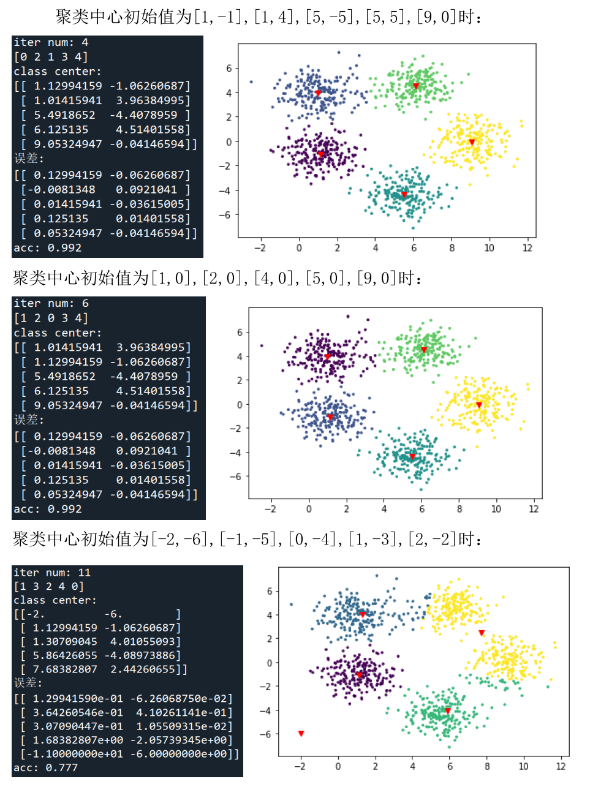

## 实验设置

数据由如下matlab代码生成，有 1000 个数据点，它们存储于矩阵 X 之中。X 是一个行数为 1000 列数为 2 的矩阵。即是说，矩阵 X 的每一行为一个数据点。各真实分布的均值向量分别为 mu1, mu2, mu3, mu4, mu5。 

```matlab
Sigma = [1, 0; 0, 1]; 
mu1 = [1, -1];   
x1 = mvnrnd(mu1, Sigma, 200); 
mu2 = [5.5, -4.5]; 
x2 = mvnrnd(mu2, Sigma, 200); 
mu3 = [1, 4];   
x3 = mvnrnd(mu3, Sigma, 200); 
mu4 = [6, 4.5];   
x4 = mvnrnd(mu4, Sigma, 200); 
mu5 = [9, 0.0];   
x5 = mvnrnd(mu5, Sigma, 200); 
 
% obtain the 1000 data points to be clustered   
X = [x1; x2; x3; x4; x5]; 
 
% Show the data point   
plot(x1(:,1), x1(:,2), 'r.'); hold on; 
plot(x2(:,1), x2(:,2), 'b.'); 
plot(x3(:,1), x3(:,2), 'k.'); 
plot(x4(:,1), x4(:,2), 'g.'); 
plot(x5(:,1), x5(:,2), 'm.'); 
```

 令聚类个数等于 5，采用不同的初始值，报告聚类精度、以及最后获得的聚类中心，并计算所获得的聚类中心与对应的真实分布的均值之间的误差。

## 实验结果

 代码见 kmeans.py

计算聚类精度时，先计算一个类别对应矩阵，得到一个指派问题，使用求解器求解得到最优的类别标签，计算精确度。

实验结果如图：

