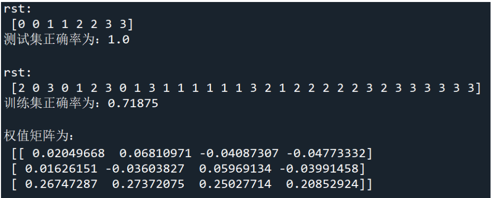

## 实验设置

使用的数据如下，见data.txt

- 感知器（batch perception）
  - 起始 a=0, 使用$w_1$和$w_2$训练。记录收敛的步数
  - 起始 a=0, 使用$w_3$和$w_2$训练。记录收敛的步数
- Ho-Kashyap  algorithm
  - 使用$w_1$和$w_3$训练。记录误差e和正确率
  - 使用$w_2$和$w_4$训练。记录误差e和正确率
- 实现MSE多类扩展方法
  - 每一类用前 8 个样本来构造分类器，用后两个样本作测试。记录正确率

## 实验结果

- 感知器（batch perception）

  1. 起始 a=0, 使用$w_1$和$w_2$训练。迭代 23 次，最终a 为  [-30.4    34.1    34. ] 

     

  2. 使用$w_3$和$w_2$训练。迭代 16 次，a 为[-41.4    48.6    19. ] 

     

- Ho-Kashyap  algorithm

  1. 迭代 100000 次，学习率为 0.01，b0=0.3，第一类和第三类不是线性可分的。误差e 如下图，很多 e 不约等于 0 且为负值。正确率为 18/20=90% 

  

  2. 迭代 592896 次，学习率为 0.001，b0=0.3，第二类和第四类线性可分。误差 e 如下图，均约等于 0。正确率为 100% 

     

- MSE多类扩展方法：

  