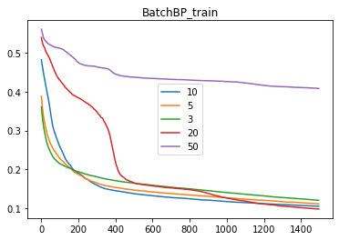

## 实验设置

使用的数据共三类，每类十个样本，样本有三个特征

第一类 10 个样本（三维空间）： 
[ 1.58,    2.32,    -5.8],      [ 0.67,    1.58,    -4.78],    [ 1.04,    1.01,    -3.63],     
[-1.49,    2.18,    -3.39],    [-0.41,    1.21,    -4.73],    [1.39,    3.16,    2.87], 
[ 1.20,    1.40,    -1.89],    [-0.92,    1.44,    -3,22],    [ 0.45,    1.33,    -4.38], 
[-0.76,    0.84,    -1.96] 
     
第二类 10 个样本（三维空间）： 
[ 0.21,    0.03,    -2.21],      [ 0.37,    0.28,    -1.8],    [ 0.18,    1.22,    0.16],     
[-0.24,    0.93,    -1.01],    [-1.18,    0.39,    -0.39],    [0.74,    0.96,    -1.16], 
[-0.38,    1.94,    -0.48],    [0.02,    0.72,    -0.17],    [ 0.44,    1.31,    -0.14], 
[ 0.46,    1.49,    0.68]  
第三类 10 个样本（三维空间）： 
[-1.54,    1.17,    0.64],      [5.41,    3.45,    -1.33],    [ 1.55,    0.99,    2.69],     
[1.86,    3.19,    1.51],        [1.68,    1.79,    -0.87],    [3.51,    -0.22,    -1.39], 
[1.40,    -0.44,    -0.92],    [0.44,    0.83,    1.97],    [ 0.25,    0.68,    -0.99], 
[ 0.66,    -0.45,    0.08] 

训练集数据可视化如下：

1.  请编写两个通用的三层前向神经网络反向传播算法程序，一个采用批量方式更新权重，另一个采用单样本方式更新权重。其中，隐含层结点的激励函数采用双曲正切函数，输出层的激励函数采用 sigmoid 函数。目标函数采用平方误差准则函数。 
2.  请利用上面的数据验证你写的程序，分析如下几点： 
    (a)  隐含层不同结点数目对训练精度的影响； 
    (b)  观察不同的梯度更新步长对训练的影响，并给出一些描述或解释； 
    (c)  在网络结构固定的情况下，绘制出目标函数随着迭代步数增加的变化曲线。 

## 实验结果

1. 

   - 运行代码：`python bpnn.py`

   - 文件中，`setting.py`为参数设置

   - 训练结果：

     单样本（默认设置为不随机选取样本）更新算法的最终训练loss为0.013，对训练集得到的预测结果为：

     [0 0 0 0 0 0 0 0 0 0 1 1 1 1 1 1 1 1 1 1 2 2 2 2 2 2 2 2 2 2]

     批量更新算法的最终训练loss为0.105，对训练集得到的预测结果为：

     [0 0 0 0 0 2 0 0 0 0 0 1 1 1 1 1 1 1 1 2 1 2 2 2 1 2 2 2 1 2]

   - 两种算法的超参数为：10个隐藏层节点，学习率为0.03，迭代1500个epoch，随机数种子为1，batch size为4，带bias。在批量更新算法中，训练集打开了随机shuffle；在单样本更新算法中，训练集没有使用随机shuffle。

2. （a）隐含层不同节点数对训练精度的影响：在一定范围内，隐含层节点数越多，模型精度越高。但当节点数过多时，模型精度反而变差。

   下图是不同隐含层节点数下的loss曲线变化情况：

   

   

   （b）不同梯度步长对训练的影响：在合理的范围内，步长越大，训练速度越快。但大步长容易产生震荡、可能在极小值附近但无法到达最优点。但大步长也可能能从局部极小中跳出，从而找到更优解。

   下图是不同梯度步长下的loss曲线变化情况：

   

   

   （c）下图为在1的设置下，两种更新方法的loss曲线

   

   

   

